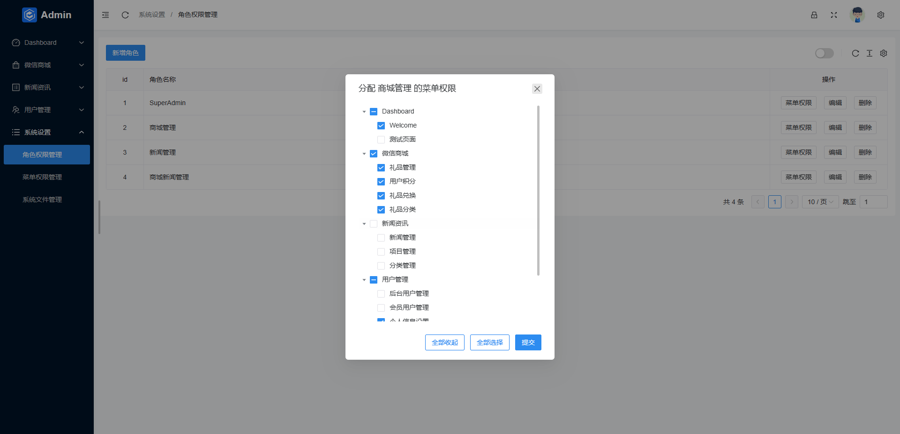
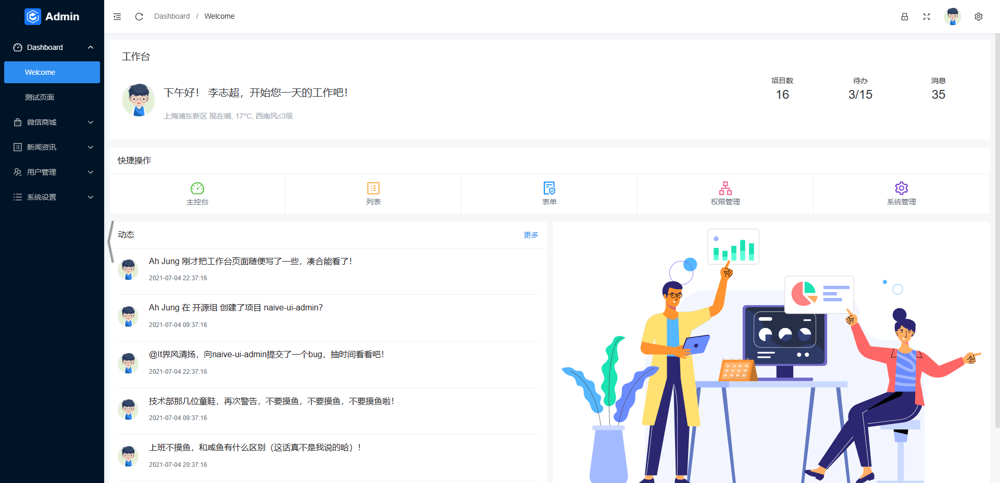

# Laravel Naive Ui Admin
前后分离！！！现有：用户管理、权限管理、文章资讯管理！
    
    
- 下载后 安装larave和npm的依赖包
- test.sql 是基础数据库 laravel数据库迁移完后 把test.sql导入进去

#### 安装laravel
- composer install or update
- cp .env.example .env
- php artisan key:generate
- php artisan storage:link

#### 有问题反馈
- 在使用中有任何问题，欢迎反馈给我，可以用以下联系方式跟我交流
- QQ: 1607470370